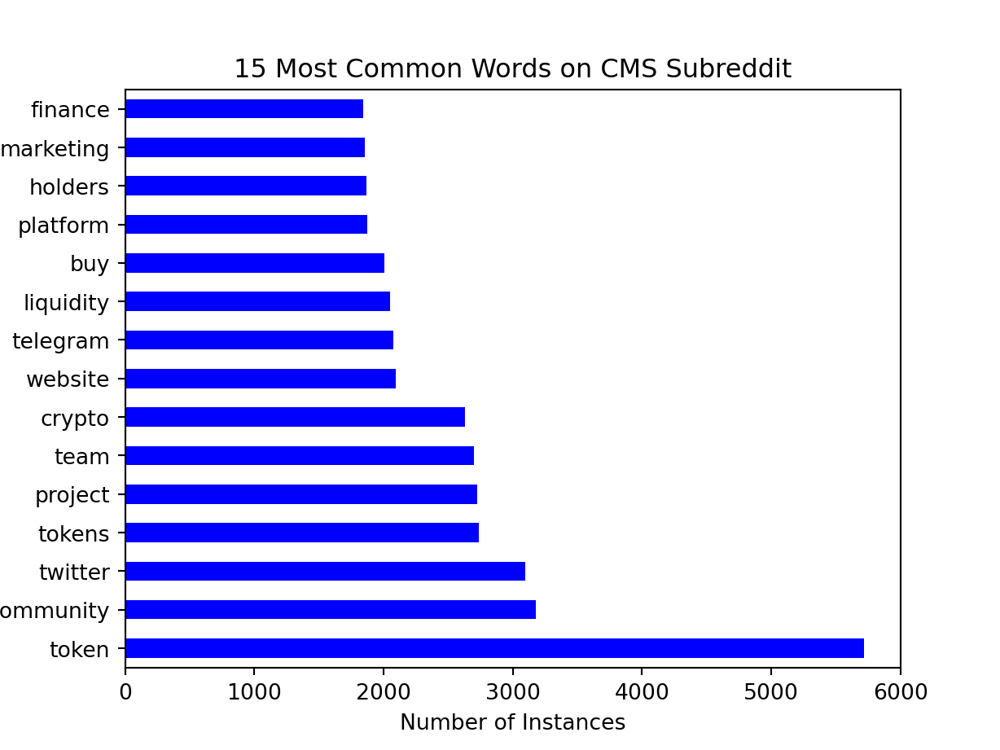

# **Project 3: Reddit APIs & NLP**

### Problem Statement

Our consulting firm, General Assembly Solutions (GAS), has been hired by Robinhood Markets, Inc. to advise on the marketing of a relatively new product. Robinhood is a financial services company that provides customers with commission-free trades of stocks and has recently expanded its offering into cryptocurrency. Robinhood is a regular advertiser on Reddit.com, with a strong presence among its public markets related subreddits such as WallStreetBets. Robinhood would like our help in better understanding the content and language differences between public markets subreddits it is currently advertising on, and cryptocurrency subreddits it is planning to advertise on. Ultimately, Robinhood would like us to build a classification model that can predict whether a post belongs to a public equity or cryptocurrency subreddit, such that it can tailor its advertising strategy appropriately. 

---

### Data Dictionary 
| Feature | Type | Dataset | Description |
| --- | --- | --- | --- |
| `created_utc` | object | `agg_data_wsb_cms` | Time the subreddit was created, represented in Unix Time |
| `subreddit` | binary | `agg_data_wsb_cms` | `0` for WallStreetBets, `1` for CryptoMoonShots |
| `title` | object | `agg_data_wsb_cms` | The title of the submission |
| `self_text` | object | `agg_data_wsb_cms` | The Markdown formatted content for a text submission |
| `text` | object | `agg_data_wsb_cms` | Concacenated `title` and `self_text` |

---

### Data Overview & Visualization

Using the Python Reddit API Wrapper [(PRAW)](https://praw.readthedocs.io/en/stable/), over 5k posts were scraped across new, controversial, hot, rising and top posts. The proportion of data collected was roughly equally split between the WallStreetBets and CryptoMoonShots subreddits. 

Looking at the distribution of subreddit title lengths, we can see that both WSB and CMS are right skewed. WSB has a mean title length of 54.5 characters, and a mean number of title words of 10.0 words. CMS has a mean title length of 98.9 characters, and a mean number of title words of 17.3 words.

 

The 15 most common words by subreddit also show notable differences. WSB top words include *GME*, *market*, *stock*, *short* and *shares*, compared to top words in CMS such as *token*, *community*, *twitter*, *project*, *team* and *crypto*. 

 

The top bigrams for WSB include phrases such as *hedge funds*, *short squeeze* and *market cap* compared to terms such as *pancakeswap finance*, *liquidity pool* and *smart contract* for CMS.

 

---

### Model Optimization & Evaluation

6 classification models were created, utilizing RandomSearchCV (50 iterations each) to search over hyperparameters and determine the best parameters that maximized model accuracy for the test data. Below are the key model evaluation metrics for each model, including accuracy, recall, precision and F1 score. 

| Model | Accuracy | Recall | Precision | F1 |
| --- | --- | --- | --- | --- |
| **Logistic Regression** | 98.6% | 97.9% | 99.4% | 0.99 |
| **Extra Trees Classifier** | 98.0% | 96.4% | 99.5% | 0.98 |
| **Random Forest** | 97.8% | 96.7% | 98.9% | 0.97 |
| **Multinomial Naive Bayes (Count Vectorizer)** | 97.2% | 98.1% | 96.3% | 0.97 |
| **Multinomial Naive Bayes (Tfid Vectorizer)** | 96.9% | 98.2% | 95.5% | 0.97 |
| **K-Nearest Neighbors** | 89.0% | 81.5% | 96.8% | 0.88 |

---

### Conclusion and Recommendation

Use of the logistic regression model is recommended, as it performed the best on the test data and maintains human interpretability due to its white box nature. This type of model is also less computationally intensive than some of the other models, such as tree classifiers. 